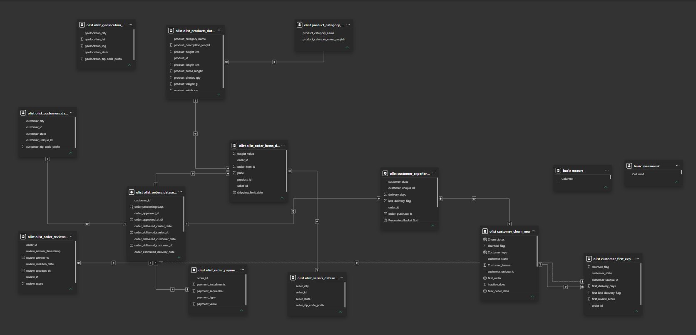
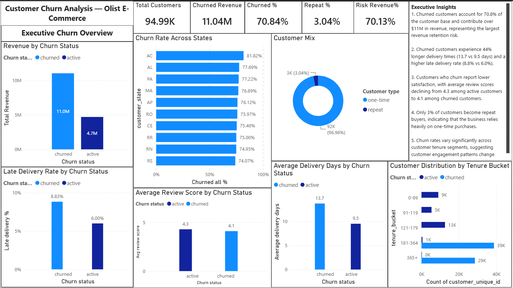
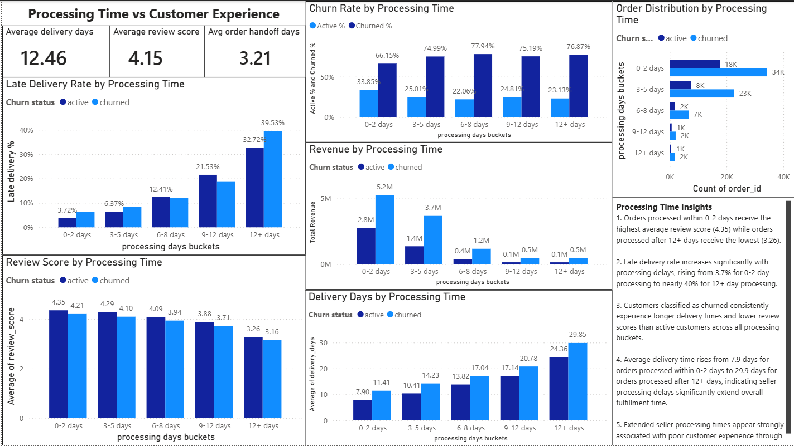
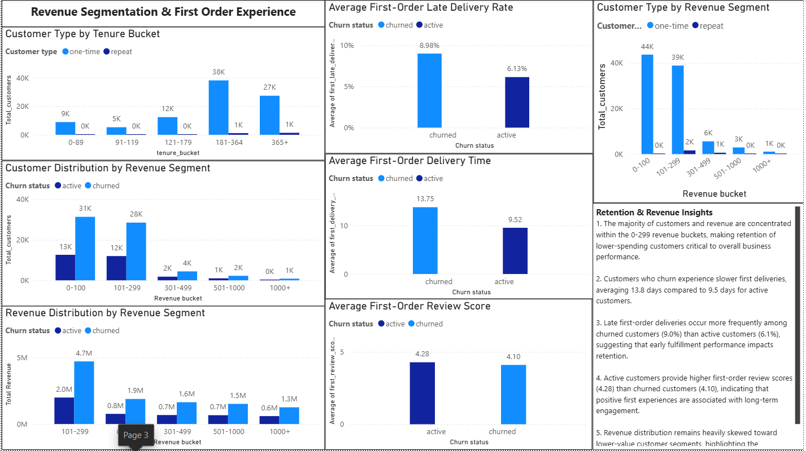

# Customer Churn Analysis – Olist E-Commerce Marketplace

## Project Overview

Customer retention is one of the most important drivers of long-term business growth in e-commerce. While acquiring new customers generates revenue, sustainable growth depends on retaining customers and increasing repeat purchase behavior.

This project analyzes customer churn and retention within the Brazilian Olist E-Commerce Marketplace using SQL and Power BI. The analysis focuses on customer behavior, revenue contribution, customer experience, operational performance, and first-order experience to identify factors associated with customer attrition and opportunities to improve retention.

---

# Business Problem

The Olist marketplace serves thousands of customers across multiple Brazilian states. However, the business lacks visibility into customer retention patterns and the factors associated with customer churn.

Without understanding why customers stop purchasing, the company risks:

* Losing future revenue from existing customers
* Increasing customer acquisition costs
* Reducing customer lifetime value
* Limiting long-term business growth

The business needs to identify which customer segments are most likely to churn, how customer experience influences retention, and which operational improvements could increase repeat purchases.

---

# Project Objective

The objective of this project is to analyze customer churn behavior and evaluate the relationship between customer experience, operational performance, purchasing behavior, and revenue retention.

The analysis aims to:

* Measure customer churn and retention.
* Quantify revenue associated with churned customers.
* Analyze repeat purchase behavior.
* Evaluate delivery performance and customer satisfaction.
* Assess the impact of seller processing delays.
* Investigate first-order experiences and their relationship with future churn.
* Identify customer segments with the highest churn risk.
* Provide actionable recommendations to improve customer retention.

---

# Business Questions

## Customer Retention

* What percentage of customers have churned?
* What percentage of customers become repeat buyers?
* How does churn vary across customer tenure segments?
* How does churn vary across customer states?

## Revenue Analysis

* How much revenue is associated with churned customers?
* Which revenue segments contribute the highest revenue?
* Which revenue segments experience the highest churn?

## Customer Experience

* Do churned customers experience longer delivery times?
* Do churned customers experience more late deliveries?
* Do churned customers provide lower review scores?

## Operational Performance

* How do seller processing delays impact customer satisfaction?
* How does processing time influence churn behavior?
* How does processing time affect delivery performance?

## First-Order Experience

* Do customers who churn experience slower first-order deliveries?
* Do customers who churn experience more late first-order deliveries?
* Do customers who churn provide lower first-order review scores?
* Does first-order experience influence long-term retention?

---

# Executive Summary

Customer retention emerged as a major challenge within the Olist marketplace. Approximately 71% of customers were classified as churned based on a 180-day inactivity threshold, while only 3% became repeat buyers.

The analysis found that customer experience is strongly associated with retention outcomes. Churned customers experienced longer delivery times, higher late-delivery rates, and lower review scores than active customers.

Operational performance also played an important role. Longer seller processing times were associated with worsening delivery performance, declining review scores, and higher churn rates.

First-order experience analysis showed that customers who eventually churned experienced slower deliveries, more late deliveries, and lower satisfaction scores during their first purchase, suggesting that early customer experiences may significantly influence long-term retention.

The findings indicate that improving fulfillment performance, reducing delivery delays, and implementing retention strategies for first-time buyers could improve customer retention and long-term revenue growth.

---

# Dataset Overview

## Dataset

Brazilian E-Commerce Public Dataset by Olist

## Source

Kaggle

## Time Period

2016–2018

## Records

* Approximately 95,000 Customers
* Approximately 99,000 Orders

## Original Tables Used

* Customers
* Orders
* Order Items
* Payments
* Reviews
* Products
* Sellers
* Geolocation
* Product Category Translation


Link: (https://www.kaggle.com/datasets/olistbr/brazilian-ecommerce)

Due to dataset size, raw files are not included in this repository.
The original dataset can be downloaded from the source above.

---

# Data Cleaning & Validation

Data preparation focused on ensuring data quality while preserving business information for analysis.

## Dataset Validation

* Reviewed all major datasets for missing values, duplicates, and inconsistencies.
* Validated relationships between customers, orders, products, reviews, and payments.
* Performed duplicate validation using business-key checks.
* No significant duplicate records requiring remediation were identified.

## Missing Value Assessment

* Investigated missing values within Orders, Products, Payments, and Reviews datasets.
* Missing delivery-related values were determined to be business-process related and associated with cancelled, unavailable, invoiced, or incomplete orders.
* Retained valid business records where information could not be reliably inferred.

## Product Data Validation

* Identified 609 products (approximately 1.85% of product records) with missing category information.
* Standardized missing categories as "Unknown" to preserve records and maintain category-level analysis.
* Identified two valid categories present in Products but absent from the translation table:

  * pc_gamer
  * portateis_cozinha_e_preparadores_de_alimentos
* Identified one product record containing only a product ID and no descriptive attributes. The record was retained due to its association with order-item transactions.

## Data Standardization

* Standardized date and datetime formats across all datasets.
* Created new datetime fields where automatic conversion was not possible.
* Standardized text formatting and corrected formatting inconsistencies within Customers, Geolocation, and Order Items datasets.
* Applied basic city-name standardization including case and whitespace normalization.

## Timestamp Validation

Investigated operational timestamp anomalies including:

* Carrier delivery occurring before purchase date.
* Carrier handoff occurring before order approval date.
* Customer delivery timestamps preceding carrier delivery timestamps.

Records were retained and documented where correct replacement values could not be reliably determined.

---

# SQL Feature Engineering

To support churn and retention analysis, several analytical tables were created.

## customer_churn_new

Customer-level lifecycle table containing:

* customer_unique_id
* customer_state
* first_order
* recent_order
* total_orders
* total_revenue
* max_order_date
* customer_tenure
* inactive_days
* churned_flag
* tenure_bucket

### Churn Definition

Customers were classified as churned if:

* Inactive Days > 180

This created a customer-level churn flag for retention analysis.

---

## customer_experience

Customer experience table containing:

* customer_unique_id
* customer_state
* order_id
* review_score
* delivery_days
* late_delivery_flag
* processing_days
* processing_days_buckets

Used to evaluate relationships between operational performance, customer satisfaction, and churn.

---

## customer_first_experience

Customer first-order experience table containing:

* customer_unique_id
* customer_state
* order_id
* churned_flag
* first_delivery_days
* first_late_delivery_flag
* first_review_score

Used to evaluate whether first-order experiences influence future retention behavior.

---

# Power BI Feature Engineering

Additional business-focused features were created within Power BI.

## Customer Segmentation

* Customer Type

  * One-Time Customer
  * Repeat Customer

* Churn Status

  * Active
  * Churned

## Revenue Segmentation

* Revenue Bucket
* Revenue Bucket Sort

Used to analyze customer value distribution and revenue concentration.

## Behavioral Segmentation

* Order Frequency Bucket

Used to analyze purchasing behavior.

## Visualization Support

* Tenure Bucket Sort
* Processing Bucket Sort

Created to ensure proper sorting within dashboard visuals.

---

# Data Model

The project follows a hybrid star-schema style analytical model combining transactional tables with analytical customer-level tables.

## Fact Tables

* Orders
* Order Items
* Payments
* Reviews

## Dimension Tables

* Customers
* Products
* Sellers
* Geolocation
* Product Category Translation

## Analytical Tables

* customer_churn_new
* customer_experience
* customer_first_experience

The model supports customer-level, order-level, operational, and retention-focused analysis.


---

# Dashboard Overview

## Page 1 – Executive Churn Overview

### Purpose

Provide an executive-level view of customer churn, revenue risk, customer composition, and customer experience.

### Analysis Included

* Revenue by Churn Status
* Churn Rate by State
* Customer Type Distribution
* Late Delivery Rate by Churn Status
* Average Review Score by Churn Status
* Average Delivery Days by Churn Status
* Customer Distribution by Tenure Bucket


---

## Page 2 – Processing Time vs Customer Experience

### Purpose

Evaluate how seller processing performance influences customer experience and retention.

### Analysis Included

* Churn Rate by Processing Time Bucket
* Revenue by Processing Time Bucket
* Review Score by Processing Time Bucket
* Delivery Time by Processing Time Bucket
* Late Delivery Rate by Processing Time Bucket


---

## Page 3 – Revenue Segmentation & First-Order Experience

### Purpose

Analyze customer value distribution and evaluate whether first-order experiences influence churn behavior.

### Analysis Included

* Customer Distribution by Revenue Segment
* Revenue Distribution by Revenue Segment
* Customer Type by Revenue Segment
* Customer Type by Tenure Bucket
* First-Order Delivery Time
* First-Order Late Delivery Rate
* First-Order Review Score


---

# Key Findings

## Customer Retention

* Approximately 71% of customers were classified as churned.
* Approximately 97% of customers made only one purchase.
* Only approximately 3% became repeat customers.

## Revenue Risk

* More than 70% of total revenue was associated with customers classified as churned.
* Revenue retention represents a significant business opportunity.

## Customer Experience

Compared with active customers, churned customers experienced:

* Longer delivery times
* Higher late-delivery rates
* Lower review scores

## Operational Performance

* Churn increased as seller processing times increased.
* Delivery performance worsened as processing delays increased.
* Customer satisfaction declined with longer processing times.

## First-Order Experience

Customers who eventually churned experienced:

* Slower first-order deliveries
* Higher first-order late-delivery rates
* Lower first-order review scores

This suggests that first-order experience may influence long-term retention outcomes.

---

# Recommendations

## High Priority

* Improve fulfillment and logistics performance.
* Reduce seller processing delays.
* Monitor late-delivery rates and intervene proactively.

## Medium Priority

* Develop retention initiatives targeting first-time buyers.
* Implement post-purchase engagement campaigns.
* Introduce loyalty and repeat-purchase programs.

## Long-Term Opportunities

* Develop predictive churn models.
* Implement customer lifetime value segmentation.
* Build automated retention monitoring dashboards.

---

# Tools & Skills Demonstrated

## SQL

* Data Cleaning & Validation
* Joins
* Aggregations
* CTEs
* Window Functions
* Feature Engineering
* Business Analysis

## Power BI

* Dashboard Development
* Data Modeling
* Interactive Reporting
* KPI Design
* Visual Storytelling

## DAX

* Measures
* Customer Segmentation
* Revenue Segmentation
* Churn Metrics

## Analytics Skills

* Customer Analytics
* Churn Analysis
* Retention Analysis
* Revenue Analysis
* Operational Analytics
* Data Storytelling
* Business Problem Solving

---

## Repository Structure

```text
Customer-Churn-Retention-Analysis/
│
├── SQL/
│   ├── import_queries.sql
│   ├── Data_Cleaning.sql
│   └── eda_analysis_queries.sql
│
├── PowerBI/
│   └── Customer_Churn_Dashboard.pbix
│
├── Documentation/
│   ├── Executive_Summary.pdf
│   ├── Data_Cleaning_Validation_Documentation.pdf
│   └── Feature_Engineering_Documentation.pdf
│
├── Images/
│   ├── Data_Model.png
│   ├── Dashboard_Page_1.png
│   ├── Dashboard_Page_2.png
│   └── Dashboard_Page_3.png
│
└── README.md
```

```
```
